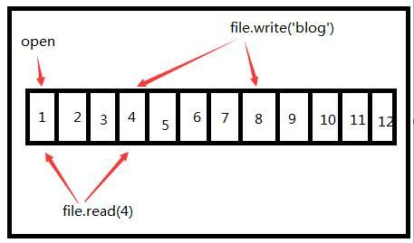

# Python文件处理之文件指针  
当我们读取文件内容时，并不能重复的读取，比如一个blogCblog.txt文件里有blogCblog内容，用两个read()方法读取blogCblog.txt的内容，会发现，第一个返回文件内容，第二个返回‘’。并不能重复读取，如果我想重复读取呢？怎么解决。  

其实这跟文件指针有关，当我们对文件操作时，文件内部会有一个文件指针来定位当前位置，如图：  

当open时文件指针是在初始位置1，当读取4个字节内容是文件指针位置就在4，再write时，文件指针从4移到8，所以，只要控制了文件指针，就能重复的读取了！  
操作文件指针可以通过seek方法：  

seek(offset, whence)：移动文件指针  
offset：偏移量，可为负数  
whence：偏移相对位置  
偏移相对位置为os模块当中的SEEK_SET、SEEK_CUR、SEEK_END：  
os.SEEK_SET：表示文件的相对起始位置  
os.SEEK_CUR：表示文件的相对当前位置  
os.SEEK_END：表示文件的相对结束位置  

来看下实例代码（一个blogCblog.txt文件里有blogCblog内容）：  
```py    
1 f = open('blogCblog.txt')  #首先先创建一个文件对象  
2 print f.read(3)  #用read()方法读取并打印  
3 print f.tell()  #打印出文件指针的位置  
4 f.close()  #关闭文件  
5   
6 #打印结果：blo  
7 #         3  
```
上面可以看到用read(3)读取3个字节的内容，而tell()方法返回文件指针的位置。下面来操作文件指针：  
```py
1 import os  #导入os模块  
2 f = open('blogCblog.txt')  #首先先创建一个文件对象，打开方式为w  
3 print f.read(3)  #用read()方法读取并打印  
4 print f.tell()  #打印出文件指针的位置  
5 f.seek(0, os.SEEK_SET)  #用seek()方法操作文件指针（把文件指针移到文件起始位置并移动0）  
6 print f.read(3)  #用read()方法再次读取并打印  
7 print f.tell()  #打印出文件指针的位置  
8 f.close()  #关闭文件  
9   
10 #打印结果：blo  
11 #         3  
12 #        blo  
13 #         3  
```
上面的代码就重复读取了，如果把第五行注释掉，那么第6、7行代码打印的结果为gCb和6，这是因为文件指针在第3，当再次读取时就在当前的文件指针向后移，这也就是为什么readline()会记住读取位置的原因了。而第5行代码的作用就是把文件指针移到初始位置！就实现了重复读取。  

当你移到指针时，偏移量大于字符串长度时就会报IOError，需要注意！  
